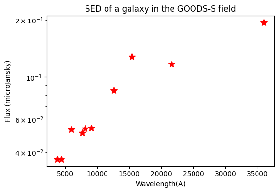
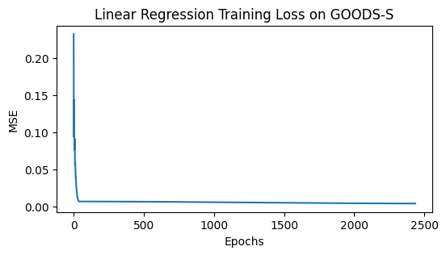
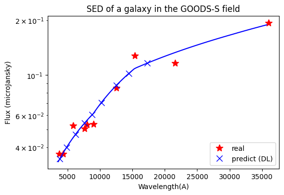

## Initializing the environment


```python
import astropy.io.fits as fits
import requests
import numpy as np
import matplotlib.pyplot as plt
from io import BytesIO
import warnings
warnings.filterwarnings('error')

def abmag(flux):
    return np.where(flux > 0, -2.5 * np.log10(flux) + 23.9, -99.0)
```

 ## Reading in the input files from Box


```python
## Reading in the 1st field: GOODS-S 
url = 'https://caltech.box.com/shared/static/yad6e2mgd1rbngrsfpkod86lly1gip18'
response = requests.get(url, allow_redirects=True)
if response.status_code == 200:
    gs = fits.getdata(BytesIO(response.content))
else:
    print("Failed to download GOODS-S.")
    
#these are the name of the filters we use in GOODS-S and their central wavelength
centerwave_gs = {'VIMOS_U_FLUX':3734,'ACS_F435W_FLUX':4317,'ACS_F606W_FLUX':5918,'ACS_F775W_FLUX':7617,'ACS_F814W_FLUX':8047,'ACS_F850LP_FLUX':9055,'WFC3_F098M_FLUX':10215,'WFC3_F125W_FLUX':12536,'WFC3_F160W_FLUX':15370,'ISAAC_KS_FLUX':21600,'IRAC_CH1_FLUX':36000}
```


```python
## Reading in the 2nd field: GOODS-N 
url = 'https://caltech.box.com/shared/static/jv3gyp0kkxnbql5wnpodujjn4cvchrud'
response = requests.get(url, allow_redirects=True)
if response.status_code == 200:
    gn = fits.getdata(BytesIO(response.content))
else:
    print("Failed to download GOODS-N.")
    
centerwave_gn = {'KPNO_U_FLUX':3647,'ACS_F435W_FLUX':4317,'ACS_F606W_FLUX':5918,'ACS_F775W_FLUX':7617,'ACS_F814W_FLUX':8047,'ACS_F850LP_FLUX':9055,'WFC3_F105W_FLUX':10215,'WFC3_F125W_FLUX':12536,'WFC3_F160W_FLUX':15370,'CFHT_KS_FLUX':21460,'IRAC_CH1_SCANDELS_FLUX':36000}
```


```python
## Reading in the 3rd field: UDS 
url = 'https://caltech.box.com/shared/static/q8oxrb3zisw0xnekrocuydxwoivge91x'
response = requests.get(url, allow_redirects=True)
if response.status_code == 200:
    uds = fits.getdata(BytesIO(response.content))
else:
    print("Failed to download UDS.")
    
centerwave_uds = {'CFHT_U_FLUX':3825,'SUBARU_B_FLUX':4500,'SUBARU_r_FLUX':5960,'ACS_F606W_FLUX':6500,'SUBARU_i_FLUX':7680,'ACS_F814W_FLUX':8047,'SUBARU_Z_FLUX':8890,'HAWKI_Y_FLUX':10215,'WFC3_F125W_FLUX':12536,'WFC3_F160W_FLUX':15370,'HAWKI_KS_FLUX':21470,'IRAC_CH1_SEDS_FLUX':36000}
```


```python
## Reading in the 4th field: EGS 
url = 'https://caltech.box.com/shared/static/sthjm6vl6b8bdhvg38lyursps9xnoc6h'
response = requests.get(url, allow_redirects=True)
if response.status_code == 200:
    egs = fits.getdata(BytesIO(response.content))
else:
    print("Failed to download EGS.")
    
centerwave_egs = {'CFHT_U_FLUX':3825,'CFHT_G_FLUX':4810,'ACS_F606W_FLUX':5960,'CFHT_R_FLUX':6250,'CFHT_I_FLUX':7690,'ACS_F814W_FLUX':8090,'CFHT_Z_FLUX':10215,'WFC3_F125W_FLUX':12536,'WFC3_F160W_FLUX':15370,'WIRCAM_K_FLUX':21460,'IRAC_CH1_FLUX':36000}
```


```python
## Reading in the 5th field: COSMOS
url = 'https://caltech.box.com/shared/static/27xwurf6t3yj2i4mn0atk7gof4y22ow9'
response = requests.get(url, allow_redirects=True)
if response.status_code == 200:
    cos = fits.getdata(BytesIO(response.content))
else:
    print("Failed to download COSMOS.")
    
centerwave_cos = {'CFHT_U_FLUX':3825,'SUBARU_B_FLUX':4500,'CFHT_G_FLUX':5960,'ACS_F606W_FLUX':6500,'CFHT_I_FLUX':7619,'ACS_F814W_FLUX':8047,'SUBARU_Z_FLUX':8829,'ULTRAVISTA_Y_FLUX':10215,'WFC3_F125W_FLUX':12536,'WFC3_F160W_FLUX':15370,'ULTRAVISTA_Ks_FLUX':21521,'IRAC_Ch1_FLUX':36000}
```

 ## Plotting the SED (spectral energy distribution) of one data point
 Flux as a function of wavelength


```python
np.random.seed(0)
randomid = np.random.randint(len(gs))
plt.figure(figsize=(6,4))
plt.title('SED of a galaxy in the GOODS-S field')
for w in centerwave_gs:
    if gs[w][randomid] > 0:  # Only plot positive flux values
        plt.plot(centerwave_gs[w],gs[w][randomid],'r*',markersize=10)

plt.yscale('log')
plt.xlabel('Wavelength(A)')
plt.ylabel('Flux (microJansky)')
plt.show()
```


    

    


##  We need output to be a catalog combined of all 5 fields with flux in the filters below:


```python
centerwave_out = {'u':3826,'g':4877,'r':6231,'i':7618,'z':8828,'y':10214,'j':12535,'h':14453,'k':17316}
```

## Analysis
In this problem, the dataset provides flux values in certain filters. From the plot above, we can see the flux-wavelength graph is approximately on a convex cruve. 

Next, let's take a look at the dataset. For example, here is the information of *GOODS-S* on given filters. There are quite a few abnormal values that we should deal with. 


```python
import pandas as pd
pd.DataFrame(gs).describe().loc[:,centerwave_gs.keys()]
```


<div>
<style scoped>
    .dataframe tbody tr th:only-of-type {
        vertical-align: middle;
    }

    .dataframe tbody tr th {
        vertical-align: top;
    }

    .dataframe thead th {
        text-align: right;
    }
</style>
<table border="1" class="dataframe">
  <thead>
    <tr style="text-align: right;">
      <th></th>
      <th>VIMOS_U_FLUX</th>
      <th>ACS_F435W_FLUX</th>
      <th>ACS_F606W_FLUX</th>
      <th>ACS_F775W_FLUX</th>
      <th>ACS_F814W_FLUX</th>
      <th>ACS_F850LP_FLUX</th>
      <th>WFC3_F098M_FLUX</th>
      <th>WFC3_F125W_FLUX</th>
      <th>WFC3_F160W_FLUX</th>
      <th>ISAAC_KS_FLUX</th>
      <th>IRAC_CH1_FLUX</th>
    </tr>
  </thead>
  <tbody>
    <tr>
      <th>count</th>
      <td>34930.000000</td>
      <td>34930.000000</td>
      <td>34930.000000</td>
      <td>34930.000000</td>
      <td>34930.000000</td>
      <td>34930.000000</td>
      <td>34930.000000</td>
      <td>34930.000000</td>
      <td>34930.000000</td>
      <td>34930.000000</td>
      <td>34930.000000</td>
    </tr>
    <tr>
      <th>mean</th>
      <td>0.322808</td>
      <td>-4.399468</td>
      <td>-0.102127</td>
      <td>-0.823109</td>
      <td>-1.483708</td>
      <td>1.686355</td>
      <td>-69.787811</td>
      <td>3.654203</td>
      <td>3.991100</td>
      <td>-5.844304</td>
      <td>3.342598</td>
    </tr>
    <tr>
      <th>std</th>
      <td>7.970996</td>
      <td>21.465401</td>
      <td>13.453255</td>
      <td>20.992052</td>
      <td>27.716833</td>
      <td>33.350401</td>
      <td>75.758593</td>
      <td>112.096743</td>
      <td>106.081086</td>
      <td>76.111678</td>
      <td>49.231254</td>
    </tr>
    <tr>
      <th>min</th>
      <td>-0.318017</td>
      <td>-99.000000</td>
      <td>-99.000000</td>
      <td>-99.000000</td>
      <td>-99.000000</td>
      <td>-99.000000</td>
      <td>-99.000000</td>
      <td>-99.000000</td>
      <td>-99.000000</td>
      <td>-99.000000</td>
      <td>-1734.010000</td>
    </tr>
    <tr>
      <th>25%</th>
      <td>0.007179</td>
      <td>0.013496</td>
      <td>0.028873</td>
      <td>0.037617</td>
      <td>0.035604</td>
      <td>0.044518</td>
      <td>-99.000000</td>
      <td>0.056951</td>
      <td>0.074858</td>
      <td>-0.006129</td>
      <td>0.081873</td>
    </tr>
    <tr>
      <th>50%</th>
      <td>0.032959</td>
      <td>0.041127</td>
      <td>0.070636</td>
      <td>0.092666</td>
      <td>0.091372</td>
      <td>0.110195</td>
      <td>-99.000000</td>
      <td>0.141888</td>
      <td>0.172424</td>
      <td>0.119335</td>
      <td>0.242488</td>
    </tr>
    <tr>
      <th>75%</th>
      <td>0.096307</td>
      <td>0.119635</td>
      <td>0.195190</td>
      <td>0.264505</td>
      <td>0.270919</td>
      <td>0.331239</td>
      <td>0.026369</td>
      <td>0.448729</td>
      <td>0.550107</td>
      <td>0.421591</td>
      <td>0.763727</td>
    </tr>
    <tr>
      <th>max</th>
      <td>773.852000</td>
      <td>332.656000</td>
      <td>964.991000</td>
      <td>1480.310000</td>
      <td>1883.650000</td>
      <td>2162.130000</td>
      <td>10004.600000</td>
      <td>11713.500000</td>
      <td>11445.400000</td>
      <td>7369.330000</td>
      <td>4842.690000</td>
    </tr>
  </tbody>
</table>
</div>


In this exercise, we need the flux in filters `centerwave_out`. However, the requested flux values are not explicitly given in the dataset, so we have to determine the unknown values based on the given relationship between flux and wavelength.

## Simple method

Since central wavelengths of output filters are within the range of given filters, we can simply implement an interpolation method to obtain the flux values. Here, I choose cubic spline method due to its high accuracy and smoothness. Then I implement it on flux values in log scale for higher accuracy. Negative flux values are filtered out.


```python
from scipy.interpolate import CubicSpline

# keep positive flux values
def del_neg(x, y):
    for i in reversed(range(len(x))):
        if y[i] <= 0:
            x = np.delete(x, i)
            y = np.delete(y, i)
    return x, y

def log_spline(wavelength, flux, centerwave_out):
    wavelength, flux = del_neg(wavelength, flux)
    flux_log = np.log(flux)
    flux_loginterp = CubicSpline(wavelength, flux_log) # interpolation in log scale
    flux_out = np.exp(flux_loginterp(centerwave_out))
    return flux_loginterp, flux_out
```

We can implement the method on all data points. First, I will demonstrate with one data point in each field. 

Plot notations: 
- *star* for original data points
- *cross* for required data points
- *line* for the interpolated curve

*All SED plots in this notebook are on log scale.*


```python
fields_name = ['GOODS-S', 'GOODS-N', 'UDS', 'EGS', 'COSMOS']
fields_var = [gs, gn, uds, egs, cos]
filters_var = [centerwave_gs, centerwave_gn, centerwave_uds, centerwave_egs, centerwave_cos]
colors = ['r', 'y', 'g', 'b', 'm']
wavelengths_out = np.array(list(centerwave_out.values()))
wavelengths_interp = np.arange(3600, 36000)
plt.rcParams["legend.loc"] = "lower right"

plt.figure(figsize=(6,4))
plt.title('SED of galaxies')
for field, fieldname, filterdic, color in zip(fields_var, fields_name, filters_var, colors):
    wavelengths = np.array(list(filterdic.values()))
    fluxes = np.array([field[filtr][randomid] for filtr in filterdic])
    flux_loginterp, flux_out = log_spline(wavelengths, fluxes, wavelengths_out)
    
    plt.plot(wavelengths, fluxes, color+'*', markersize=9, label=fieldname)
    plt.plot(wavelengths_out, flux_out, color+'x', markersize=8)
    plt.plot(wavelengths_interp, np.exp(flux_loginterp(wavelengths_interp)), color)

plt.yscale('log')
plt.xlabel('Wavelength(A)')
plt.ylabel('Flux (microJansky)')
plt.legend()
plt.show()
```


    

    


For cubic spline method, the output values are close to real values though the interpolated curve does not fit very well. 

Then, I implement the method on all data points and concatenate output values into a pandas dataframe.


```python
data_out = [[]] * 5
i = 0
for field, filterdic in zip(fields_var, filters_var):
    data_outi = np.empty(len(wavelengths_out))
    for id in range(field.shape[0]):
        try:
            wavelengths = np.array(list(filterdic.values()))
            fluxes = np.array([field[filtr][id] for filtr in filterdic])
            _, flux_out = log_spline(wavelengths, fluxes, wavelengths_out)
            data_outi = np.vstack((data_outi, flux_out))
        except ValueError as e:
            # pass galaxies with 1 or less positive flux value
            pass
        except RuntimeWarning:
            # pass overflow
            pass
    data_out[i] = data_outi
    i += 1
```


```python
data_col1 = np.array([[field] * len(centerwave_out) for field in fields_name]).flatten()
data_col2 = np.array(list(centerwave_out.keys()) * len(fields_name))
df_list = [[]] * 5
for i in range(5):
    col_name = [fields_name[i] + '_' + key for key in list(centerwave_out.keys())]
    df_list[i] = pd.DataFrame(data=data_out[i], columns=pd.Series(col_name))
df_out = df_list[0]
for i in range(4):
    if (df_list[i].shape[0] >= df_list[i+1].shape[0]):
        df_out = df_out.join(df_list[i+1], how='left')
    else:
        df_out = df_out.join(df_list[i+1], how='right')
```

`df_out` is the output dataframe. It consists of 45 columns and 41440 rows. The column names show the field and filter names. Since the five fields do not have the same amount of data, there are some null values. 


```python
df_out
```


<div>
<style scoped>
    .dataframe tbody tr th:only-of-type {
        vertical-align: middle;
    }

    .dataframe tbody tr th {
        vertical-align: top;
    }

    .dataframe thead th {
        text-align: right;
    }
</style>
<table border="1" class="dataframe">
  <thead>
    <tr style="text-align: right;">
      <th></th>
      <th>GOODS-S_u</th>
      <th>GOODS-S_g</th>
      <th>GOODS-S_r</th>
      <th>GOODS-S_i</th>
      <th>GOODS-S_z</th>
      <th>GOODS-S_y</th>
      <th>GOODS-S_j</th>
      <th>GOODS-S_h</th>
      <th>GOODS-S_k</th>
      <th>GOODS-N_u</th>
      <th>...</th>
      <th>EGS_k</th>
      <th>COSMOS_u</th>
      <th>COSMOS_g</th>
      <th>COSMOS_r</th>
      <th>COSMOS_i</th>
      <th>COSMOS_z</th>
      <th>COSMOS_y</th>
      <th>COSMOS_j</th>
      <th>COSMOS_h</th>
      <th>COSMOS_k</th>
    </tr>
  </thead>
  <tbody>
    <tr>
      <th>0</th>
      <td>100.000000</td>
      <td>0.000000</td>
      <td>0.000000</td>
      <td>0.000000</td>
      <td>100.000000</td>
      <td>0.000000</td>
      <td>0.000000</td>
      <td>0.000000</td>
      <td>1.000000</td>
      <td>0.005644</td>
      <td>...</td>
      <td>0.095421</td>
      <td>0.079554</td>
      <td>0.060142</td>
      <td>0.052342</td>
      <td>0.055742</td>
      <td>0.059737</td>
      <td>0.063360</td>
      <td>0.090573</td>
      <td>0.108412</td>
      <td>0.093617</td>
    </tr>
    <tr>
      <th>1</th>
      <td>0.964782</td>
      <td>2.706869</td>
      <td>8.142444</td>
      <td>15.675621</td>
      <td>21.868319</td>
      <td>29.020069</td>
      <td>37.903233</td>
      <td>48.062685</td>
      <td>74.340647</td>
      <td>0.032227</td>
      <td>...</td>
      <td>1.295280</td>
      <td>0.006146</td>
      <td>0.002181</td>
      <td>0.007923</td>
      <td>0.126000</td>
      <td>0.283214</td>
      <td>0.011755</td>
      <td>0.000008</td>
      <td>0.000001</td>
      <td>0.000012</td>
    </tr>
    <tr>
      <th>2</th>
      <td>0.156623</td>
      <td>0.153481</td>
      <td>0.114620</td>
      <td>0.106965</td>
      <td>0.179835</td>
      <td>0.336898</td>
      <td>0.489005</td>
      <td>0.436706</td>
      <td>0.236129</td>
      <td>0.026460</td>
      <td>...</td>
      <td>0.149837</td>
      <td>0.094936</td>
      <td>0.105511</td>
      <td>0.123474</td>
      <td>0.157822</td>
      <td>0.188543</td>
      <td>0.112989</td>
      <td>0.141132</td>
      <td>0.214242</td>
      <td>0.238068</td>
    </tr>
    <tr>
      <th>3</th>
      <td>0.702554</td>
      <td>1.864877</td>
      <td>3.769996</td>
      <td>5.176865</td>
      <td>5.987766</td>
      <td>6.882993</td>
      <td>8.466251</td>
      <td>9.865260</td>
      <td>11.984796</td>
      <td>0.012186</td>
      <td>...</td>
      <td>0.205921</td>
      <td>0.024272</td>
      <td>0.045451</td>
      <td>0.099819</td>
      <td>0.287036</td>
      <td>0.470723</td>
      <td>0.289180</td>
      <td>0.373926</td>
      <td>0.434189</td>
      <td>0.440454</td>
    </tr>
    <tr>
      <th>4</th>
      <td>0.035936</td>
      <td>0.126099</td>
      <td>0.336259</td>
      <td>0.535128</td>
      <td>0.612837</td>
      <td>0.649677</td>
      <td>0.706325</td>
      <td>0.807781</td>
      <td>1.098142</td>
      <td>0.085599</td>
      <td>...</td>
      <td>0.154173</td>
      <td>0.247318</td>
      <td>0.314165</td>
      <td>0.411902</td>
      <td>0.536417</td>
      <td>0.609963</td>
      <td>0.540834</td>
      <td>0.622059</td>
      <td>0.885813</td>
      <td>1.206951</td>
    </tr>
    <tr>
      <th>...</th>
      <td>...</td>
      <td>...</td>
      <td>...</td>
      <td>...</td>
      <td>...</td>
      <td>...</td>
      <td>...</td>
      <td>...</td>
      <td>...</td>
      <td>...</td>
      <td>...</td>
      <td>...</td>
      <td>...</td>
      <td>...</td>
      <td>...</td>
      <td>...</td>
      <td>...</td>
      <td>...</td>
      <td>...</td>
      <td>...</td>
      <td>...</td>
    </tr>
    <tr>
      <th>41435</th>
      <td>NaN</td>
      <td>NaN</td>
      <td>NaN</td>
      <td>NaN</td>
      <td>NaN</td>
      <td>NaN</td>
      <td>NaN</td>
      <td>NaN</td>
      <td>NaN</td>
      <td>NaN</td>
      <td>...</td>
      <td>0.065563</td>
      <td>NaN</td>
      <td>NaN</td>
      <td>NaN</td>
      <td>NaN</td>
      <td>NaN</td>
      <td>NaN</td>
      <td>NaN</td>
      <td>NaN</td>
      <td>NaN</td>
    </tr>
    <tr>
      <th>41436</th>
      <td>NaN</td>
      <td>NaN</td>
      <td>NaN</td>
      <td>NaN</td>
      <td>NaN</td>
      <td>NaN</td>
      <td>NaN</td>
      <td>NaN</td>
      <td>NaN</td>
      <td>NaN</td>
      <td>...</td>
      <td>0.211744</td>
      <td>NaN</td>
      <td>NaN</td>
      <td>NaN</td>
      <td>NaN</td>
      <td>NaN</td>
      <td>NaN</td>
      <td>NaN</td>
      <td>NaN</td>
      <td>NaN</td>
    </tr>
    <tr>
      <th>41437</th>
      <td>NaN</td>
      <td>NaN</td>
      <td>NaN</td>
      <td>NaN</td>
      <td>NaN</td>
      <td>NaN</td>
      <td>NaN</td>
      <td>NaN</td>
      <td>NaN</td>
      <td>NaN</td>
      <td>...</td>
      <td>0.030525</td>
      <td>NaN</td>
      <td>NaN</td>
      <td>NaN</td>
      <td>NaN</td>
      <td>NaN</td>
      <td>NaN</td>
      <td>NaN</td>
      <td>NaN</td>
      <td>NaN</td>
    </tr>
    <tr>
      <th>41438</th>
      <td>NaN</td>
      <td>NaN</td>
      <td>NaN</td>
      <td>NaN</td>
      <td>NaN</td>
      <td>NaN</td>
      <td>NaN</td>
      <td>NaN</td>
      <td>NaN</td>
      <td>NaN</td>
      <td>...</td>
      <td>0.093617</td>
      <td>NaN</td>
      <td>NaN</td>
      <td>NaN</td>
      <td>NaN</td>
      <td>NaN</td>
      <td>NaN</td>
      <td>NaN</td>
      <td>NaN</td>
      <td>NaN</td>
    </tr>
    <tr>
      <th>41439</th>
      <td>NaN</td>
      <td>NaN</td>
      <td>NaN</td>
      <td>NaN</td>
      <td>NaN</td>
      <td>NaN</td>
      <td>NaN</td>
      <td>NaN</td>
      <td>NaN</td>
      <td>NaN</td>
      <td>...</td>
      <td>0.062677</td>
      <td>NaN</td>
      <td>NaN</td>
      <td>NaN</td>
      <td>NaN</td>
      <td>NaN</td>
      <td>NaN</td>
      <td>NaN</td>
      <td>NaN</td>
      <td>NaN</td>
    </tr>
  </tbody>
</table>
<p>41440 rows × 45 columns</p>
</div>


Then, we can convert the dataframe to another type we want and save the file. For example, to `Table` in `astropy`.


```python
from astropy.table import Table
file_out = Table.from_pandas(df_out)
file_out.info
```


    <Table length=41440>
       name    dtype     class     n_bad
    --------- ------- ------------ -----
    GOODS-S_u float64 MaskedColumn  6516
    GOODS-S_g float64 MaskedColumn  6516
    GOODS-S_r float64 MaskedColumn  6516
    GOODS-S_i float64 MaskedColumn  6516
    GOODS-S_z float64 MaskedColumn  6516
    GOODS-S_y float64 MaskedColumn  6516
    GOODS-S_j float64 MaskedColumn  6516
    GOODS-S_h float64 MaskedColumn  6516
    GOODS-S_k float64 MaskedColumn  6516
    GOODS-N_u float64 MaskedColumn  6000
    GOODS-N_g float64 MaskedColumn  6000
    GOODS-N_r float64 MaskedColumn  6000
    GOODS-N_i float64 MaskedColumn  6000
    GOODS-N_z float64 MaskedColumn  6000
    GOODS-N_y float64 MaskedColumn  6000
    GOODS-N_j float64 MaskedColumn  6000
    GOODS-N_h float64 MaskedColumn  6000
    GOODS-N_k float64 MaskedColumn  6000
        UDS_u float64 MaskedColumn  5522
        UDS_g float64 MaskedColumn  5522
        UDS_r float64 MaskedColumn  5522
        UDS_i float64 MaskedColumn  5522
        UDS_z float64 MaskedColumn  5522
        UDS_y float64 MaskedColumn  5522
        UDS_j float64 MaskedColumn  5522
        UDS_h float64 MaskedColumn  5522
        UDS_k float64 MaskedColumn  5522
        EGS_u float64       Column     0
        EGS_g float64       Column     0
        EGS_r float64       Column     0
        EGS_i float64       Column     0
        EGS_z float64       Column     0
        EGS_y float64       Column     0
        EGS_j float64       Column     0
        EGS_h float64       Column     0
        EGS_k float64       Column     0
     COSMOS_u float64 MaskedColumn  2785
     COSMOS_g float64 MaskedColumn  2785
     COSMOS_r float64 MaskedColumn  2785
     COSMOS_i float64 MaskedColumn  2785
     COSMOS_z float64 MaskedColumn  2785
     COSMOS_y float64 MaskedColumn  2785
     COSMOS_j float64 MaskedColumn  2785
     COSMOS_h float64 MaskedColumn  2785
     COSMOS_k float64 MaskedColumn  2785


## Machine learning - L1 regularization

Regarding to noise and errors in observations, not all data points are accurate and should be fitted perfectly. In machine learning, it's crucial to add a penalty function to prevent overfitting. Here, I implemented L1 regularization method on the dataset. 


```python
from sklearn.linear_model import Lasso
from sklearn.model_selection import cross_val_score
X_predict = np.array(list(centerwave_out.values()))
X_all = wavelengths_interp
```


```python
plt.figure(figsize=(6,4))
plt.title('SED of galaxies')
for field, fieldname, filterdic, color in zip(fields_var, fields_name, filters_var, colors):
    X_train = np.array(list(filterdic.values()))
    y_train = np.array([field[filtr][randomid] for filtr in filterdic])
    X_train, y_train = del_neg(X_train, y_train)
    
    # define model
    lasso = Lasso(alpha=0.1)
    lasso.fit(X_train.reshape(-1,1), y_train)
    scores = cross_val_score(lasso, X_train.reshape(-1,1), y_train, cv=5, scoring='neg_mean_squared_error')
    print(f'mean squared error for {fieldname}:\t{scores.mean()}')
    y_predict = lasso.predict(X_predict.reshape(-1,1))
    y_all = lasso.predict(X_all.reshape(-1,1))
    
    plt.plot(X_train, y_train, color+'*', markersize=9, label=fieldname)
    plt.plot(X_predict, y_predict, color+'x', markersize=8)
    plt.plot(X_all, y_all, color)

plt.yscale('log')
plt.ylim(10**(-1.8), 7)
plt.xlabel('Wavelength(A)')
plt.ylabel('Flux (microJansky)')
plt.legend()
plt.show()
```

    mean squared error for GOODS-S:	-0.0008078579538156822
    mean squared error for GOODS-N:	-0.1483027408870464
    mean squared error for UDS:	-8.09049506398981e-05
    mean squared error for EGS:	-0.06640539553100672
    mean squared error for COSMOS:	-0.007568829442659052


    

    


This time, the predicted curve does not fit all data correctly but looks like a simple function. We may find out the exact relationship by trying the combination of basic functions with similar shapes.

## Deep Learning - linear regression

We can also solve the problem with deep learning models. Let's try a simple linear regression model with four layers, two of which are hidden. The first hidden layer has 16 nodes and the second one has 32 nodes.


```python
import torch
import torch.nn as nn
import torch.nn.functional as F

device = torch.device('cuda' if torch.cuda.is_available() else 'cpu')

class MLP(nn.Module):
    def __init__(self):    
        super(MLP, self).__init__()
        self.layers = nn.Sequential(
            nn.Linear(1, 16),
            nn.ReLU(),
            nn.Linear(16, 32),
            nn.ReLU(),
            nn.Linear(32, 1)
        )

    def forward(self, x):
        x = self.layers(x)
        return x

# the following code for early stopping is from:
# https://stackoverflow.com/questions/71998978/early-stopping-in-pytorch
class EarlyStopper:
    def __init__(self, patience=1, min_delta=0):
        self.patience = patience
        self.min_delta = min_delta
        self.counter = 0
        self.min_validation_loss = float('inf')

    def early_stop(self, validation_loss):
        if validation_loss < self.min_validation_loss:
            self.min_validation_loss = validation_loss
            self.counter = 0
        elif validation_loss > (self.min_validation_loss + self.min_delta):
            self.counter += 1
            if self.counter >= self.patience:
                return True
        return False
```

To train the model, I use mean squared error as error function and stochastic gradient descent as optimizer. The largest epoch number is set to 10000 while early stopping is enabled. For simplicity, I only trained on one galaxy from GOODS-S. 

The model was trained on cpu and `manual_seed` is set for reproducibility.


```python
torch.manual_seed(97)

field = fields_var[0]
filterdic = filters_var[0]
X_train = np.array(list(filterdic.values()))
y_train = np.array([field[filtr][randomid] for filtr in filterdic])
X_train, y_train = del_neg(X_train, y_train)

# rescale training data
X_train = X_train / 30000
y_train = y_train * 7

X_train = torch.as_tensor(X_train.reshape(-1,1)).float().to(device)
y_train = torch.as_tensor(y_train.reshape(-1,1)).float().to(device)

mlp = MLP()
mlp.to(device)
loss_func = nn.MSELoss()
optimizer = torch.optim.SGD(mlp.parameters(), lr=0.038, momentum=0.8)
early_stopper = EarlyStopper(patience=10, min_delta=1e-10)

# train
EPOCHS = 10000
loss_all = []
for epoch in range(EPOCHS):
    y_predict = mlp(X_train)
    loss = loss_func(y_predict, y_train)
    optimizer.zero_grad()
    loss.backward()
    optimizer.step()
    loss_all.append(loss.data)
    
    if (early_stopper.early_stop(loss.data)):
        print('Epoch {0: <3}  loss={1}'.format(str(epoch+1), loss.data))
        EPOCHS = epoch + 1
        break
    if ((epoch+1) % 500 == 0):
        print('Epoch {0: <3}  loss={1}'.format(str(epoch+1), loss.data))
print('Training end.')
```

    Epoch 500  loss=0.006579643581062555
    Epoch 1000  loss=0.005811817944049835
    Epoch 1500  loss=0.00499557564035058
    Epoch 2000  loss=0.004367755260318518
    Epoch 2436  loss=0.00399771798402071
    Training end.


Plot training loss. 


```python
plt.figure(figsize=(6,3))
plt.plot(range(EPOCHS), loss_all)
plt.title('Linear Regression Training Loss on GOODS-S')
plt.xlabel('Epochs')
plt.ylabel('MSE')
plt.show()
```


    

    


Plot predicted values.


```python
X_out = torch.as_tensor((np.array(list(centerwave_out.values())) / 30000).reshape(-1,1)).float()
y_out = mlp(X_out)
X_predict = torch.as_tensor(np.arange(0.12, 1.2, 0.01).reshape(-1,1)).float()
y_predict = mlp(X_predict)
plt.figure(figsize=(6,4))
plt.plot(X_train * 30000, y_train / 7, 'r*', markersize=10, label='real')
plt.plot(X_out.numpy() * 30000, y_out.detach().numpy() / 7, 'bx',markersize=9, label='predict (DL)')
plt.plot(X_predict.numpy() * 30000, y_predict.detach().numpy() / 7, 'b')
plt.yscale('log')
plt.rcParams['legend.loc'] = 'lower right'
plt.legend()
plt.title('SED of a galaxy in the GOODS-S field')
plt.xlabel('Wavelength(A)')
plt.ylabel('Flux (microJansky)')
plt.show()
```


    

    


The predicted curve goes between real data points, which is what we expected.
